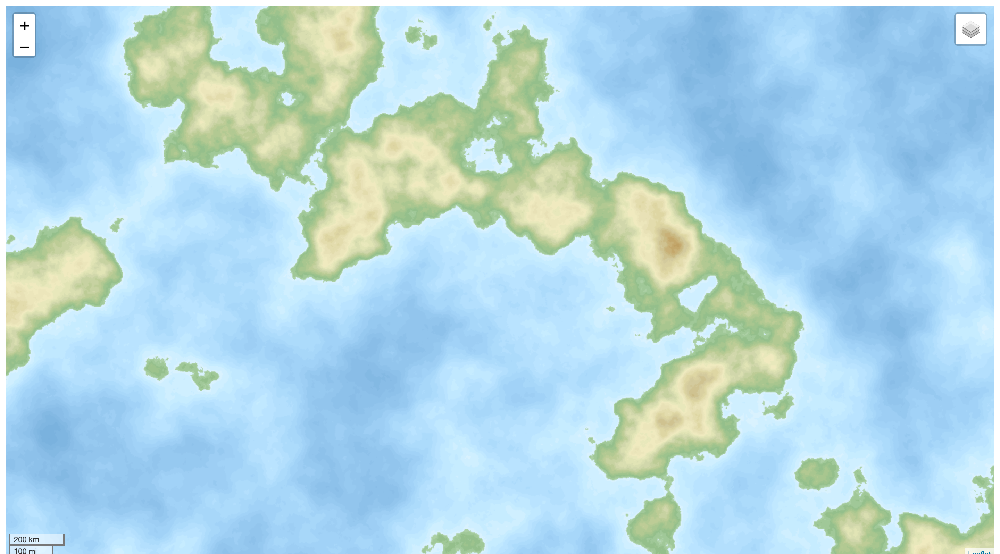
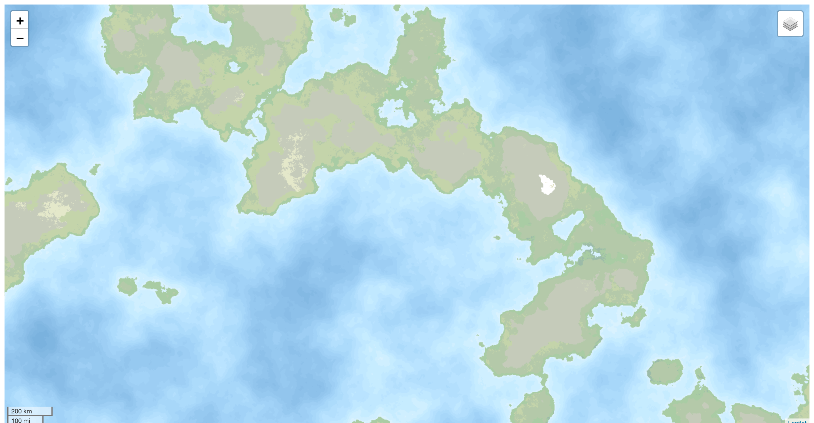
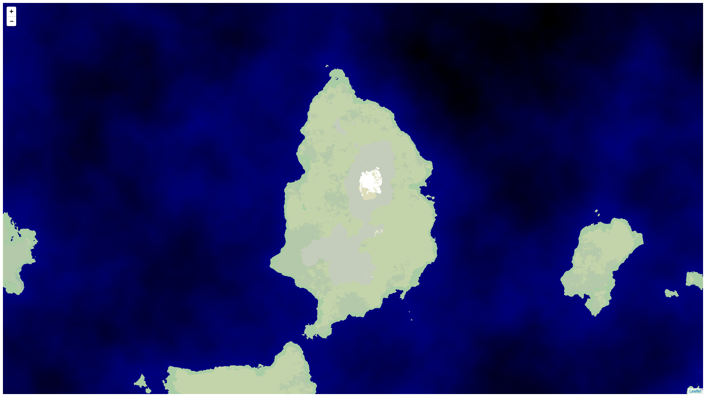
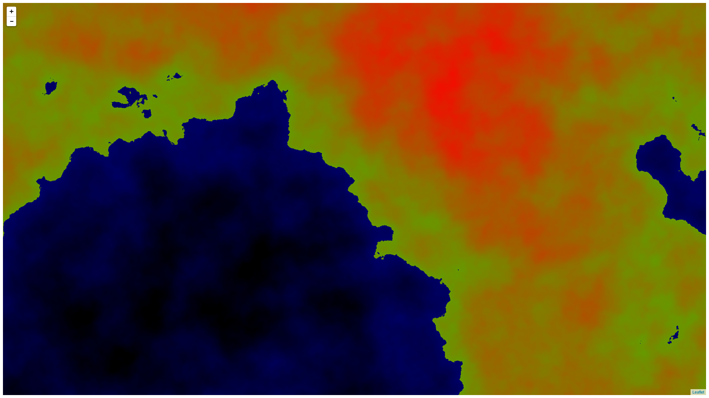

# simplexnoisemapgenerator

This is an exercise in procedurally generating heightmaps. [Leaflet] is used to display the results on a webpage.

At this moment it is using two instances of simplex noise at different frequencies to generate heightmap. Biomes are calculated using elevation above sea level and rainfall value generated from another instance of simplex noise.

I am pretty aware this is exactly kind of thing that Node should not be used for - a lot of thread blocking operations. This is just for fun though, and I enjoy writing JavaScript.

## Installation

Should be straightforward:

1. Have `node.js` installed - 6.x or newer is required, 10.x is recommended (it's 2019!)
1. Clone from github
1. Install node-canvas dependencies - see [instructions here][node-canvas github]
   - Windows users: don't be afraid! It does work!
   - Debian (and maybe Ubuntu) users: use `libjpeg62-turbo-dev` instead of `libjpeg8-dev`
1. Run `npm install`
1. Run `node index.js`
1. Go to [http://localhost:3000](http://localhost:3000)

You might want to use [PM2] to run several instances in parallel to quicker generate the tiles. Running `pm2 start index.js -i 0` will start a number of instances equal to the number of available CPU cores at your machine.

### Docker

There's an alpine based Dockerfile in repository with Node 10 and PM2 so just `docker build .` and `docker run -p3000:3000 %image%` and you should be good to go. It even works fine on Raspberry Pi, although you probably want RPi 4 for this and it still will be struggling.

For reasons unknown (I really don't fancy analyzing node-gyp's idiosyncrasies) building will occasionally fail on compiling native node packages. Just rerun until it succeeds.

It fails 100% of time (sample size = 3) when using a Node 12 base image.

By default PM2 is configured to run on as many cores, as available to docker. To change this setting either update `instances` in `ecosystem.config.js` to something else than `0`, or use [appropriate `docker run` configuration][Docker RUN cpuset-constraint docs]

## Static example
### 0.0.6 
  Heightmap 
  Biomes 
### 0.0.4 
### 0.0.3 

## Working example

I have set it up on [http://code.michaljarosz.net/demo/simplexnoisemapgenerator](http://code.michaljarosz.net/demo/simplexnoisemapgenerator). This runs on a Raspberry Pi 4 so do expect poor performance.

## Version history

* 0.0.6 - Heightmap now uses a palette taken from [Wikipedia map Conventions] and boy does it look nice. 
Also heightmap and biomes layers are both available now and can be switched through UI control.
Added a scale control just for fun.
* 0.0.5 - Package updates. Added Dockerfile. No functional changes.
* 0.0.4 - Added biome generation based on Polygonal Map Generation for Game from Red Blob Games article (see below)
* 0.0.3 - First released implementation. Heightmap only

## Reading material

* [Christian Maher: Working with Simplex Noise](https://cmaher.github.io/posts/working-with-simplex-noise/)
* [Polygonal Map Generation for Game from Red Blob Games](http://www-cs-students.stanford.edu/~amitp/game-programming/polygon-map-generation/)

## License

MIT

[Docker RUN cpuset-constraint docs]: https://docs.docker.com/engine/reference/run/#cpuset-constraint
[Leaflet]: http://leafletjs.com/
[node-canvas github]: https://github.com/Automattic/node-canvas
[PM2]: http://pm2.keymetrics.io/
[Wikipedia map conventions]: https://en.wikipedia.org/wiki/Wikipedia:WikiProject_Maps#/media/File:Maps_template-en.svg
